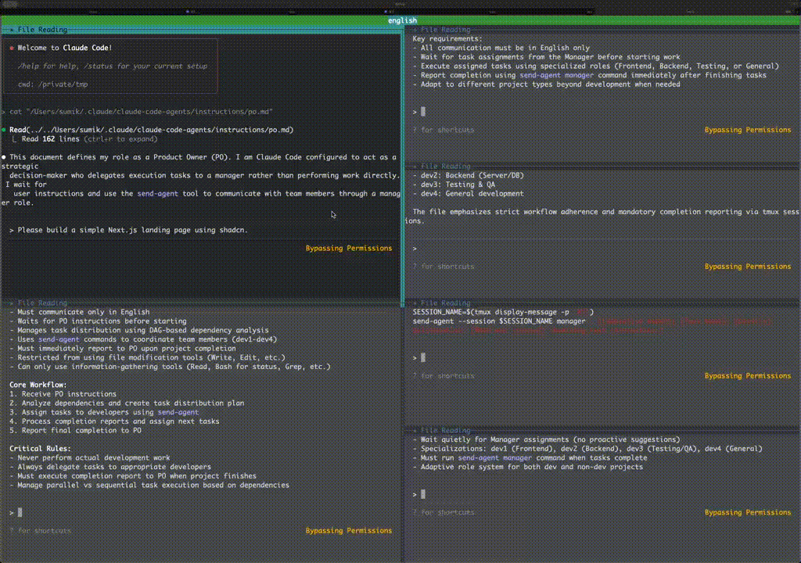

# Claude Squad(Claude Code Agent Parallel Execution System)

[日本語READMEはこちら](../README.md)

(This is generated by Claude Code, so it may not be perfect. Please feel free to correct it.)

An integrated development environment system that runs Claude Code AI agents in parallel on tmux.
By providing instructions to the Product Owner, the Manager will appropriately analyze the work, and various Dev Role agents will process tasks in parallel.

## Overview

This project is a toolset for running multiple AI agents in parallel to streamline team development. It consists of two main components:



- **start-agents**: Main system for launching and managing AI agent sessions
- **send-agent**: Client tool for sending messages to running agents

## 🚀 Usage

### Prerequisites

* tmux
* Claude Code CLI (please complete authentication first)

### Preparation

Create the necessary environment information for startup using the `--init` command.
Files are saved to `~/.claude/claude-squad/agents.json` by default.

The `--init` command requires a language parameter (`ja` or `en`), and instruction files for the specified language will be copied.

```bash
git clone https://github.com/catenas-g/claude-squad.git
cd claude-squad
# install start-agents and send-agent to /usr/local/bin
make install

# Initialize configuration (using English instruction files)
claude-squad --init en

# Initialize configuration (using Japanese instruction files)
# claude-squad --init ja

# Run system diagnostics
claude-squad --doctor

# View configuration file information
claude-squad --show-config
```

### Setting Agent Constraints

The Claude Code launched by this program starts with `dangerously-skip-permissions` enabled.
Therefore, if you don't impose constraints on agents, they will act quite freely, which can be inconvenient.

Please refer to [settings.json](./docs/settings.json) and configure the `allow` and `deny` settings in `~/.claude/claude-squad/settings.json`.

#### Launching Agents

Claude Code operates based on the startup directory.

```bash
# Navigate to the target project folder
cd [project_folder]
# Start by specifying a session name
claude-squad [session_name]
```

**Launched agents:**
- `po`: Product Owner (overall management), top-left pane
- `manager`: Project Manager (team management), bottom-left pane
- `dev1-dev4`: Execution agents (flexible role adaptation), right-side panes

#### Agent Definition Files

The operational definitions for each agent are stored in `~/.claude/claude-squad/instructions`.
They are saved in the format `<role>.md`, so please modify them according to your environment and restart the application.

When you run `claude-squad --init en`, English instruction files will be automatically copied. If you run `claude-squad --init ja`, Japanese instruction files will be copied instead.

## FAQ

### Q: Can startup be made faster?

This program was originally created in bash.
It was rewritten in Go to parallelize the startup of each agent in order to reduce startup time.
However, Claude Code's authentication information is managed in a single file, and when starting simultaneously, this file often gets corrupted, requiring authentication input in each launched pane.

Therefore, currently it starts one by one with timer delays, which is slow. (We want to speed it up...)

### Q: PO/Manager/Dev stopped properly passing data to other roles.

This can happen when conversations become lengthy or occasionally during processing.
It can sometimes be fixed by reloading the role file as follows:

```bash
cat "~/.claude/claude-squad/instructions/developer.md"
```

### Q: PO/Manager started generating code themselves

It can be fixed by giving instructions like "You are the PO. Please give instructions instead of working yourself."

### Q: Developer is not reporting work completion to Manager

This can also happen when conversation volume increases.

Adding the phrase "If work is completed, please report appropriately to the manager using send-agent" can fix it. Alternatively, reloading the role file would be good.

## 📄 License

MIT License - See [LICENSE](../LICENSE) file for details.

## 🤝 Contributing

Contributions to the project are welcome.

- [Issues](https://github.com/catenas-g/claude-squad/issues) - Bug reports and feature requests
- [Pull Requests](https://github.com/catenas-g/claude-squad/pulls) - Code contributions
- [Discussions](https://github.com/catenas-g/claude-squad/discussions) - Questions and discussions
